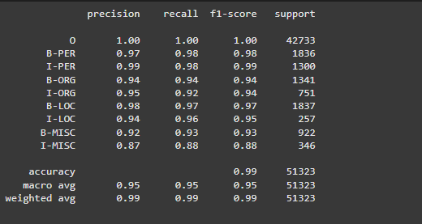
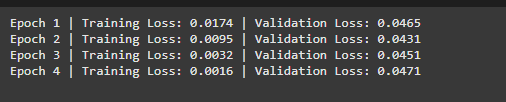
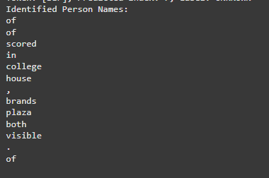

# NER Model for Named Entity Recognition

## Installation

To get started, clone this repository and install the required dependencies.

```bash
git clone https://github.com/dilukshashamal/week_5_assignment.git
cd week_5_assignment
```
## Introduction

Named Entity Recognition (NER) is a crucial task in Natural Language Processing (NLP) that involves identifying and classifying entities in text into predefined categories such as names of people, organizations, locations, expressions of times, quantities, monetary values, percentages, etc. This project aims to implement a state-of-the-art NER model using BERT.

## Description

This project implements a Named Entity Recognition (NER) model using BERT to identify and classify entities in text data. The model is trained on the CoNLL-2003 dataset, which includes annotations for various entity types, including:

- **PER**: Person names
- **ORG**: Organizations
- **LOC**: Locations
- **MISC**: Miscellaneous entities

The model uses Hugging Face's `transformers` library to leverage the capabilities of pre-trained BERT models, making it effective for NER tasks.

## Features

- Utilizes a pre-trained BERT model for token classification.
- Supports dynamic padding for efficient batch processing.
- Implements early stopping and learning rate scheduling for better training performance.
- Evaluates performance using precision, recall, and F1-score metrics.
- Visualizes results and predictions.

 
 </br>
 
